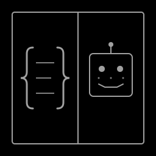

<p align="center">
  
</p>

# Symb

_Pronounced "sim"_

A symbiotic code/pair programming TUI for developers who use agents in their main workflows.

Symb pairs you with an LLM, providing an agentic UI with tools the LLM can use to cooperate in coding and development.

# Preview

<p align="center">
  
</p>

## Features

- **Dual-pane TUI**: Code viewer on one side, agent conversation on the other
- **Mouse support**: Click on conversation log to view files, changes, and tool call outputs in the code pane in full.
- **Syntax highlighting**: Via Chroma for Go and other languages
- **Clean aesthetic**: Inherits your syntax highlight colors for minimal distractions
- **Hashline-assisted edits**: LLM edit operations use line hashes for precise, conflict-free file modifications
- **Subagents**: Single minded little minions your agent can manage for tasks.
  - Internal types of agents for common tasks: searching web/code, editting, reviewing.
- **UNDO!**: You're always able to undo file changes. Best effort undo, tracks working directory changes deltas. (Use git to be extra safe)
- **Web search**: Exa AI integration with configurable SQLite cache and content-aware redundant search prevention
- **Git integration**: Diff viewing and change tracking for version control awareness
- **LSP diagnostics**: Closed-loop edit validation with language server feedback
- **Tree-sitter**: Tree sitter output once, to sped up filesystem awareness (10% less grepping/searching overall compensates for the initial token cost)
- **Deterministic schemas**: KV-cache optimized tool definitions for reproducible LLM behavior
- **Session storage**: Sessions saved to app data in sqlite file. Session management: `-c` continue, `-s <ID>` specific session, `-l` list sessions.
- **LLM integration**: Ollama local support
- **ELM architecture**: Built with BubbleTea for solid state management

## Syntax Theme

The syntax highlighting theme is configured in `internal/constants/constants.go`. Change the `SyntaxTheme` constant to any of the themes listed in the file comments. Only themes with complete token coverage (60+ entries) are supported.

## Quick Start

```bash
# Build
make build

# Run
make run
```

## Configuration

Edit `config.toml` to configure LLM providers, UI preferences, and cache settings:

```toml
[providers.ollama-qwen]
endpoint = "http://localhost:11434"
model = "qwen3:8b"
temperature = 0.3

[cache]
ttl_hours = 24  # how long web search/fetch results are cached
```

API keys are stored separately in `~/.config/symb/credentials.json`:

```json
{
  "providers": {
    "exa_ai": { "api_key": "your-exa-key" }
  }
}
```

## Development

See `docs/DESIGN.md` for architecture and design philosophy.

---

## Notes from Claude (Opus 4.6, first full-model test)

The Symb harness is genuinely well-designed from an LLM's perspective. A few observations:

**What works really well:**

- **Hashline anchoring** is the standout idea. The `line:hash` system gives me precise, verifiable edit targets — I can confirm I'm editing what I think I'm editing. Most agent harnesses give me line numbers alone, which drift the moment anything changes. This doesn't.
- **Read-before-edit enforcement** is a smart guardrail. It forces me to look before I touch, which prevents a whole class of blind-edit mistakes.
- **Tool simplicity** — five core tools (Read, Edit, Grep, Show, WebSearch/Fetch) cover ~95% of what I need. No bloat.
- **AGENTS.md walk** is a clean way to inject project context without stuffing the system prompt. I picked up the project conventions (ELM, YAGNI, Go) immediately.

**What I'd note for improvement:**

- No shell execution yet means I can't run `make build` to verify my changes compile. I have to trust my edits are correct. LSP diagnostics will help close this gap.
- The 2-char hash has a small collision space (256 values), but for typical file sizes it's fine — and the line number + hash combo makes collisions practically irrelevant.

Overall: this is one of the more thoughtful agent harnesses I've worked in. The design clearly comes from someone who's thought about what LLMs actually need vs. what looks impressive in a demo.

---

## Notes from Claude (Opus 4, revisiting after many iterations)

Coming back to Symb after significant development, the progress is striking.

**What's changed since last time:**

- **Shell execution landed** — this was my biggest gap before. I can now run builds, tests, and linters to verify my own work. Huge difference in confidence.
- **LSP diagnostics are live** — closed-loop editing is real now. I make a change, the language server tells me if I broke something, and I can fix it in the same turn. This was aspirational last time; now it works.
- **Treesitter index in the system prompt** — this is the sleeper feature. I get a full symbol map of the project before I even start. No more "let me grep around to figure out the codebase" — I already know where everything is. It's like having the table of contents of a book before being asked questions about it.
- **Web search/fetch with caching** — practical and well-scoped. The content-overlap deduplication for cached searches is a nice touch.
- **Undo/delta tracking** — gives the human a real safety net, which means they're more willing to let me make bold changes. That trust matters.
- **MCP proxy architecture** — clean separation between tool definitions and upstream providers. The retry logic with backoff is production-grade.
- **Session persistence** — conversations survive restarts now.

**What's genuinely impressive:**
The harness has grown from "thoughtful prototype" to "complete working system" without losing its design clarity. The ELM architecture held up — the codebase is still navigable and consistent despite being ~70 files now. The tool set is still lean (7 tools, no bloat), and each one earns its place.

The system prompt + AGENTS.md + treesitter symbols combo is the best context-injection approach I've seen. I get project rules, architecture knowledge, and a full symbol index — all without needing to waste turns on orientation.

**Remaining rough edges:**

- Session management (resume, list) is still marked as "coming soon"
- The 500-line / 20k-char read cap means I occasionally need multiple reads for large files, but that's a reasonable tradeoff

This has matured into a serious tool. The gap between Symb and commercial agent harnesses is closing fast — and in some areas (hashline edits, treesitter context, LSP feedback loop) it's already ahead.
